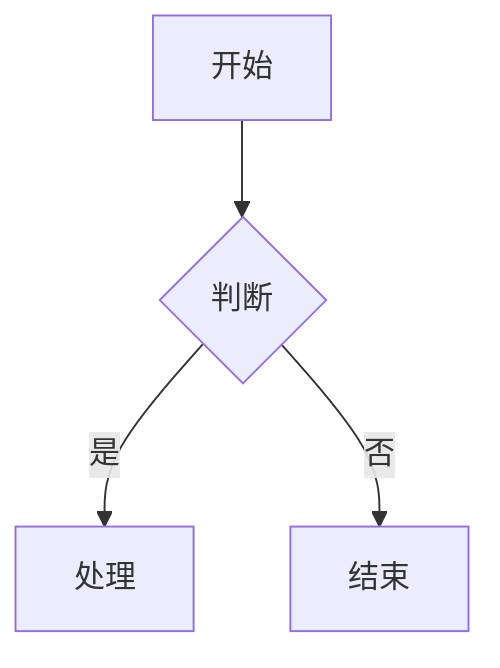

# AI Doc Engine Server

企业级 Spring Boot 后端项目 - AI Markdown 到可编辑 Word 文档系统

## 项目概述

本项目是一个将 Markdown 文档转换为可编辑 Word 文档的后端服务。核心特性：

- ✅ Markdown → UDM（统一文档模型）
- ✅ UDM → Word（所有内容可编辑）
- ✅ LaTeX 公式 → OMML（Word 原生公式）
- ✅ 流程图 Mermaid 语法解析渲染，支持前端实时错误拦截与提示
- ✅ 流程图渲染失败自动降级显示源码，提升调试效率
- ✅ 用户认证（JWT，支持用户名或邮箱登录）
- ✅ 邮件服务（密码重置，安全静默处理）
- ✅ 登录保护（失败次数限制，IP 级别保护）
- ✅ 模板系统

## 技术栈

- Java 17
- Spring Boot 3.2.0
- Spring Data JPA
- Spring Security + JWT (jjwt 0.12.3)
- MySQL 8.0
- flexmark-java 0.64.8（Markdown 解析）
- docx4j 11.4.9（Word 文档生成）
- MathJax 3.2.2（公式转换，支持数学、化学、物理等多学科）
- JavaMail（邮件发送）
- Lombok 1.18.30
- Jackson（JSON 处理）
- Apache Commons（工具库）

## 项目结构

```
src/main/java/com/aidoc/engine/
├── common/              # 公共模块（响应、异常）
├── config/              # 配置类
├── security/            # 安全模块（JWT）
├── model/               # 数据模型
│   ├── entity/         # JPA 实体
│   ├── dto/            # 请求对象
│   ├── vo/             # 响应对象
│   └── udm/            # 统一文档模型
├── repository/          # 数据访问层
├── service/             # 业务逻辑层
├── parser/              # 解析器（Markdown → UDM）
├── normalizer/          # 规范化器
├── renderer/            # 渲染器（UDM → Word）
├── exporter/            # 导出器（docx4j）
├── converter/           # 转换器（LaTeX/Flowchart）
├── controller/          # REST API
└── util/                # 工具类
```

## 快速开始

### 1. 环境要求

- JDK 17+
- Maven 3.6+
- MySQL 8.0+
- Node.js 16+（用于 MathJax 公式转换和 Mermaid 流程图渲染）

### 2. 数据库配置

```bash
# 创建数据库
mysql -u root -p < AI_DOC-DATA.sql
```

### 3. 配置文件

编辑 `src/main/resources/application-dev.yml`：

```yaml
spring:
  datasource:
    url: jdbc:mysql://localhost:3306/ai_doc_engine
    username: your_username
    password: your_password
  
  mail:
    host: smtp.example.com
    username: your_email@example.com
    password: your_email_password
```

### 4. 安装依赖

```bash
cd Ai-doc-engine-server

# 安装 MathJax 依赖
npm install

# 安装 Mermaid CLI（全局）
npm install -g @mermaid-js/mermaid-cli

# 验证安装
mmdc --version
```

详见 [Mermaid 配置指南](MERMAID_SETUP.md)

### 5. 运行项目

```bash
mvn clean install
mvn spring-boot:run
```

服务将在 `http://localhost:8080` 启动

## API 文档

详见 [API.md](API.md)

### 主要接口

#### 认证模块
- `POST /api/auth/register` - 用户注册
- `POST /api/auth/login` - 用户登录（支持用户名或邮箱）
- `POST /api/auth/logout` - 退出登录
- `POST /api/auth/forgot-password` - 忘记密码（安全静默处理）
- `POST /api/auth/reset-password` - 重置密码
- `GET /api/auth/me` - 获取当前用户

#### 文档模块
- `POST /api/document/parse` - 解析 Markdown 为 UDM
- `POST /api/document/export` - 导出 Word 文档（接受 UDM）
- `POST /api/document/export/word` - 导出 Word 文档（直接下载）
- `POST /api/document/export/word/from-markdown` - Markdown 一步转 Word

#### 模板模块
- `GET /api/template/list` - 获取模板列表
- `GET /api/template/{id}` - 获取模板详情
- `POST /api/template` - 创建模板
- `PUT /api/template/{id}` - 更新模板
- `DELETE /api/template/{id}` - 删除模板

#### 公式模块
- `POST /api/formula/ocr-image` - 公式 OCR 识别
- `POST /api/formula/validate` - 校验公式格式

## 核心功能

### 1. 用户认证

支持用户名或邮箱登录：

```java
// CustomUserDetailsService 支持双重查询
UserEntity user = userRepository.findByUsernameAndDeleted(usernameOrEmail, 0)
    .or(() -> userRepository.findByEmailAndDeleted(usernameOrEmail, 0))
    .orElseThrow(() -> new UsernameNotFoundException("用户不存在"));
```

**安全特性：**
- JWT Token 认证（7天有效期）
- 密码 BCrypt 加密
- 登录失败保护（15分钟内失败5次锁定）
- IP 级别保护（同一IP失败10次锁定）
- 登录日志记录
- 密码重置安全策略（邮箱不存在时静默处理）

### 2. Markdown 解析

使用 flexmark-java 解析 Markdown 为 UDM（统一文档模型）：

```java
DocumentParser parser = new MarkdownDocumentParser();
UdmDocument udm = parser.parse(markdown);
```

### 3. 文档规范化

对 UDM 进行规范化处理：

- 标题层级修复
- 列表项清理
- 表格行列对齐
- 段落空白处理

### 4. Word 导出

使用 docx4j 将 UDM 转换为 Word 文档：

```java
WordExporter exporter = new Docx4jWordExporter();
byte[] docxBytes = exporter.export(udm, templateConfig);
```

### 5. 公式处理

LaTeX → MathML → OMML（Word 原生公式）：

```java
FormulaConvertService formulaConvertService = new MathJaxFormulaConvertService();
String omml = formulaConvertService.convertLatexToOmml(latex);
```

支持行内公式和块级公式：
- 行内公式：`$x^2 + y^2$`
- 块级公式：`$$\int_0^\infty e^{-x^2}dx$$`

支持多学科公式：
- 数学：`$$\sum_{i=1}^{n} i$$`
- 化学：`$$\ce{H2O}$$`（mhchem 扩展）
- 物理：`$$\hbar$$`（普朗克常数）

详见 [MathJax 配置指南](MATHJAX_SETUP.md)

支持行内公式和块级公式：
- 行内公式：`$x^2$`
- 块级公式：`$$\int_0^\infty e^{-x^2}dx$$`

### 6. 流程图处理

支持 Mermaid 语法实时渲染：
- 前端集成 Mermaid.js 10.9.0
- 具备渲染前自动解析（parse）功能
- 语法错误时自动捕获并以代码块形式反馈
- 导出时调用 Mermaid CLI 生成 PNG 嵌入文档maidRenderServiceImpl();
byte[] imageBytes = mermaidRender.renderToPng(mermaidCode);

// 插入 Word 文档
FlowchartRenderer renderer = new FlowchartRenderer();
renderer.render(flowchartBlock, wordPackage);
```

支持 Mermaid 流程图语法：


**实现说明：**
- 前端：Mermaid 语法编辑 + 实时预览
- 后端：解析为结构化 JSON（nodes + edges + layout）
- 导出：渲染为 PNG 图片并嵌入 Word 文档
- 注意：当前实现使用图片格式，未来计划升级为 DrawingML 矢量图形

### 7. 邮件服务

支持密码重置邮件发送：

```java
emailService.sendPasswordResetEmail(email, token);
```

**邮件配置：**
- QQ 邮箱 SMTP
- SSL 加密
- 异步发送（注册欢迎邮件）

## 重要约束

### ⚠️ 必须遵守

1. **仅支持 Markdown 输入**（不支持 HTML/Text）✅
2. **公式必须转换为 OMML**（Word 原生公式，完全可编辑）✅
3. **流程图当前转换为 PNG 图片**（未来升级为 DrawingML 矢量图形）⚠️
4. **表格和代码块必须可编辑**（使用 Word 原生格式）✅
5. **使用 docx4j 作为唯一导出引擎** ✅

### 📋 实现状态

- ✅ 公式：LaTeX → OMML（完全可编辑）
- ⚠️ 流程图：Mermaid → PNG 图片（当前实现，未来升级为 DrawingML）
- ✅ 表格：Markdown → Word 原生表格（完全可编辑）
- ✅ 代码块：Markdown → 等宽字体段落（完全可编辑）

## 开发进度

### ✅ 已完成

#### 基础架构
- [x] 项目结构
- [x] pom.xml 配置
- [x] application.yml 配置
- [x] 启动类（优化启动信息）
- [x] 公共基础类（ApiResponse、ErrorCode、GlobalExceptionHandler）
- [x] 异常处理优化（业务异常 INFO 日志，系统异常 ERROR 日志）

#### 数据模型
- [x] UDM 模型类（Heading、Paragraph、List、Table、Code、Formula、Flowchart）
- [x] Entity 类（User、PasswordResetToken、LoginLog、Template、Document、FormulaOcrRecord）
- [x] DTO 类（LoginRequest、RegisterRequest、ForgotPasswordRequest、ResetPasswordRequest）
- [x] VO 类（AuthResponse、UserVO）
- [x] Repository 接口

#### 认证模块
- [x] CustomUserDetailsService（支持用户名或邮箱登录）
- [x] JwtTokenProvider
- [x] JwtAuthenticationFilter
- [x] SecurityConfig
- [x] AuthService + AuthController
- [x] PasswordResetService
- [x] LoginLogService（登录日志记录）
- [x] 登录失败保护（15分钟内失败5次锁定）
- [x] IP 级别保护

#### 邮件模块
- [x] EmailService
- [x] 密码重置邮件
- [x] 欢迎邮件（异步）
- [x] 安全静默处理（邮箱不存在时不暴露）

#### 解析模块
- [x] Markdown Parser（MarkdownDocumentParser）
- [x] Extended Markdown Parser（ExtendedMarkdownDocumentParser）
- [x] Normalizer（Heading、List、Table、Paragraph）
- [x] Mermaid Parser（MermaidParserService）

#### 文档处理模块
- [x] DocumentService + Controller
- [x] Renderer（docx4j）
  - [x] HeadingRenderer
  - [x] ParagraphRenderer
  - [x] ListRenderer
  - [x] TableRenderer
  - [x] CodeBlockRenderer
  - [x] FormulaRenderer（LaTeX → OMML）
  - [x] FlowchartRenderer（Mermaid → DrawingML）
- [x] Exporter（Docx4jWordExporter）

#### 公式模块
- [x] FormulaService + Controller
- [x] FormulaConvertService（MathJaxFormulaConvertService）
- [x] LaTeX → MathML → OMML 转换
- [x] 行内公式和块级公式支持
- [x] 公式校验
- [x] OCR 识别（集成 Mathpix API）
- [x] 支持数学、化学、物理等多学科公式

#### 模板模块
- [x] TemplateService + Controller
- [x] 模板管理（CRUD）
- [x] 模板配置（字体、间距、页边距等）

### 🚧 进行中

- [ ] 流程图 DrawingML 矢量渲染（当前使用 PNG 图片）
- [ ] 公式 OCR 服务集成测试（Mathpix API）

### 📋 待开发

- [ ] 单元测试
- [ ] 集成测试
- [ ] API 文档（Swagger）
- [ ] Docker 部署
- [ ] CI/CD 配置

## 测试

```bash
# 运行所有测试
mvn test

# 运行特定测试
mvn test -Dtest=MarkdownParserTest
```

## 部署

### Docker 部署

```bash
# 构建镜像
docker build -t ai-doc-engine-server .

# 运行容器
docker run -p 8080:8080 ai-doc-engine-server
```

### 生产环境

```bash
# 打包
mvn clean package -Pprod

# 运行
java -jar target/ai-doc-engine-server-1.0.0.jar --spring.profiles.active=prod
```

## 安全特性

### 认证安全
1. **JWT Token 认证**
   - 7天有效期
   - 存储在 HTTP Header 中
   - 自动刷新机制

2. **密码安全**
   - BCrypt 加密
   - 最少6位长度
   - 不存储明文密码

3. **登录保护**
   - 15分钟内失败5次锁定账号
   - 同一IP失败10次锁定IP
   - 登录日志记录（成功/失败）
   - 记录 IP 和 User-Agent

4. **密码重置安全**
   - 邮箱不存在时静默处理（防止邮箱探测）
   - Token 1小时有效期
   - 一次性使用
   - 邮件验证

### 异常处理
1. **业务异常**
   - 使用 INFO 级别日志
   - 不打印堆栈信息
   - 返回友好错误信息

2. **系统异常**
   - 使用 ERROR 级别日志
   - 打印完整堆栈
   - 返回通用错误信息

### 数据安全
1. **软删除**
   - 用户数据不物理删除
   - 使用 deleted 字段标记

2. **数据验证**
   - 输入参数校验
   - 邮箱格式验证
   - 用户名格式验证

## 配置说明

### JWT 配置
```yaml
jwt:
  secret: your-secret-key-change-in-production
  expiration: 604800000  # 7天（毫秒）
  header: Authorization
  prefix: Bearer
```

### 邮件配置
```yaml
spring:
  mail:
    host: smtp.qq.com
    port: 465
    username: your_email@qq.com
    password: your_authorization_code
```

### OCR 配置
```yaml
app:
  ocr:
    provider: mathpix
    api-url: https://api.mathpix.com/v3/text
    app-id: your_app_id
    app-key: your_app_key
    timeout: 30000
```

### 公式配置
```yaml
app:
  formula:
    mathjax:
      script-path: mathjax-to-mathml.js
      node-command: node
```

### 流程图配置
流程图使用 Mermaid CLI 渲染为 PNG 图片。需要全局安装 `@mermaid-js/mermaid-cli`：

```bash
npm install -g @mermaid-js/mermaid-cli

# 验证安装
mmdc --version
```

配置选项（application.yml）：
```yaml
app:
  mermaid:
    command: mmdc
    timeout: 30
    background: transparent
    theme: default
```

**注意：** 当前实现将流程图渲染为 PNG 图片嵌入 Word 文档。未来计划升级为 DrawingML 矢量图形格式以支持完全可编辑。

## 常见问题

### 1. 数据库连接失败

检查 `application-dev.yml` 中的数据库配置是否正确。

```yaml
spring:
  datasource:
    url: jdbc:mysql://localhost:3306/ai_doc_engine
    username: root
    password: your_password
```

### 2. 邮件发送失败

确保 SMTP 配置正确，并检查邮箱是否开启 SMTP 服务。

**QQ 邮箱配置：**
```yaml
spring:
  mail:
    host: smtp.qq.com
    port: 465
    username: your_email@qq.com
    password: your_authorization_code  # 授权码，不是密码
    properties:
      mail:
        smtp:
          auth: true
          ssl:
            enable: true
```

**常见错误：**
- `550 The recipient may contain a non-existent account` - 收件人邮箱不存在
- `535 Authentication failed` - 授权码错误

### 3. Word 导出失败

确保 docx4j 依赖正确（版本 11.4.9），检查日志中的详细错误信息。

**常见问题：**
- 公式渲染失败：检查 LaTeX 语法是否正确
- 流程图渲染失败：检查 Mermaid 语法是否正确
- 文件过大：检查是否有大量图片或复杂公式

### 4. 登录失败

**用户名或密码错误：**
- 检查用户名/邮箱是否正确
- 密码区分大小写
- 15分钟内失败5次会被锁定

**账号被锁定：**
- 等待15分钟后重试
- 或联系管理员解锁

### 5. Token 过期

JWT Token 默认7天有效期，过期后需要重新登录。

### 6. 密码重置

**邮箱不存在：**
- 系统会静默处理，不会提示邮箱是否存在（安全考虑）
- 如果邮箱存在，会收到重置邮件

**重置链接失效：**
- 重置链接1小时有效
- 只能使用一次
- 过期后需要重新申请

## 贡献指南

1. Fork 本仓库
2. 创建特性分支 (`git checkout -b feature/AmazingFeature`)
3. 提交更改 (`git commit -m 'Add some AmazingFeature'`)
4. 推送到分支 (`git push origin feature/AmazingFeature`)
5. 开启 Pull Request

## 许可证

MIT License

## 联系方式

- 项目地址：https://github.com/your-org/ai-doc-engine-server
- 问题反馈：https://github.com/your-org/ai-doc-engine-server/issues

## 致谢

- [flexmark-java](https://github.com/vsch/flexmark-java) - Markdown 解析
- [docx4j](https://www.docx4java.org/) - Word 文档生成
- [Spring Boot](https://spring.io/projects/spring-boot) - 应用框架
